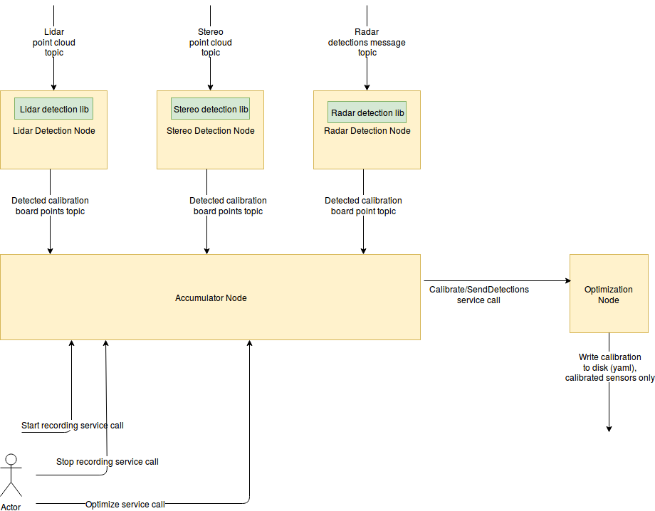
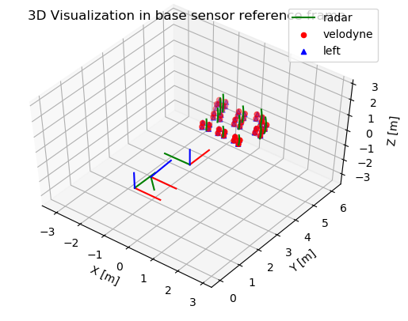
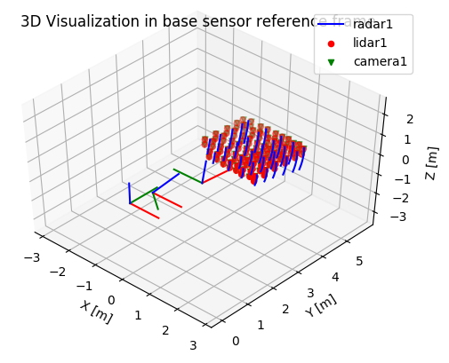

# MULTI_SENSOR_CALIBRATION

This repository contains a calibration tool to calibrate a sensor setup consisting of lidars, radars and cameras. Using this extrinsic sensor calibration tool, the sensor poses can be estimated with respect to each other. This code has bindings with Robot Operating System (ROS). For more information, we would like to refer to the ICRA 2019 conference paper (see [1]).

## Getting Started

This tutorial explains how to use the _multi_sensor_calibration_ toolbox. It consists of the following main components:
- detector nodes detect the calibration board (see [calibration board](docs/calibration_board.md)) for every sensing modality (lidar, monocular/stereo camera, and radar)
- accumulator node collects the detections of the various calibration board locations.
- optimizer node optimizes all sensors poses.
- urdf writer updates the sensors poses in the URDF file.

### Prerequisites

The code has been developed in Ubuntu 16.04 LTS in combination with ROS Kinetic Kame. Furthermore, the software has been tested on Ubuntu 18.04 LTS in combination with ROS Melodic Morenia.

### Installing

The following ROS dependencies are present:
```
    apt-get install ros-<ros_distro>-desktop-full
    apt-get install ros-<ros_distro>-pcl-ros
    apt-get install ros-<ros_distro>-opencv3
    apt-get install ros-<ros_distro>-ros-numpy
    apt-get install ros-<ros_distro>-astuff-sensor-msgs
```
The following packages need to be installed:

```
    apt-get install libeigen3-dev
    apt-get install python-rospkg
    apt-get install build-essential
    apt-get install python3-dev
    apt-get install python3-setuptools
    apt-get install libatlas-dev
    apt-get install libatlas3-base
    apt-get install python3-numpy
    apt-get install python3-scipy
    apt-get install python3-pip
    apt-get install python3-matplotlib
    apt-get install python3-yaml
    apt-get install python3-sklearn  
    pip3 install rmsd
    pip3 install rospkg
    pip3 install matplotlib2tikz
```
Clone our _multi_sensor_calibration_ package to the src folder as well. After that, build catkin workspace:
```
    git clone https://github.com/tudelft-iv/multi_sensor_calibration.git
    cd <path to catkin_ws folder>
    catkin_make
    source devel/setup.bash
```

### Performing Extrinsic Sensor Calibration
The overview of the components in the calibration tool are visualized in the following figure. Note that in this figure the calibration is performed with a single lidar, radar and stereo camera. The calibration tool can accommodate more sensors. More details on subscribed and published topics for the detectors nodes can be found in [detectors](docs/detectors.md).


The next steps need to be performed to calibrate your sensor setup.

#### Update parameters in YAML files.
For each detector, the YAML file is used to define the parameters of the detector. For instance the geometry of the calibration board is defined in here:
- Lidar Detector:  lidar_detector/config/config.yaml
- Stereo Detector: stereo_detector/config/config.yaml
- Mono Detector:   mono_detector/config/config.yaml
- Radar detector: the ROS parameters are defined to detect the specific return from the trihedral corner reflector (minimum and maximum RCS and calibration range).

Note that we provide some additional information about the detectors in: [detectors](docs/detectors.md).

#### Start calibration board detectors for lidar, radar and camera.
This can be done by:
```
    rosrun lidar_detector lidar_detector_node
    rosrun radar_detector radar_detector_node    
    rosrun stereo_detector stereo_detector_node     
    rosrun mono_detector mono_detector_node     
```
For instance, you can find for every node the subscribed and published topics. We recommend you to visualize the published topics to check if the detectors are working (see [detectors](docs/detectors.md)).

We also provide a launch file with the lidar, camera and radar detector in the package _multi_sensor_calibration_launch_ :
```
    roslaunch multi_sensor_calibration_launch detectors.launch
```
Note: In case of multiple sensors, multiple instances of the detectors should be launched. This means that topics have to be remapped.

Check the terminal of the _accumulator_ to check status messages.

#### Start Accumulator (Manager)
The accumulator collects all detections from various calibration board locations and prepares the data set with calibration board detections that will be send to the optimizer.
```
    rosrun accumulator accumulator
```
Alternatively, the launch file can be used:
```
    roslaunch multi_sensor_calibration_launch accumulator.launch
```
#### Start Optimizer (Pose Estimator)
The optimizer python node estimates all sensors poses given the sensors measurements. If your calibration board geometry differs from ours, change it in the python file _optimization/src/optimization/calibration_board.py_. The python file _optimization/src/optimization/config.py_ contains the information about the sensor setup and specific information about the sensors.
```
    rosrun optimization server.py
```
The _multi_sensor_calibration_launch_ also contains a launch file that runs the optimizer:
```
    roslaunch multi_sensor_calibration_launch optimizer.launch
```
The default joint optimization configuration is Fully Connected Pose Estimation (FCPE) (see [1] for more information) and the default reference sensor is _Velodyne_. The _calibration_mode_  and _reference_sensor_ can be changed in the by setting the following ROS parameters:
```
    rosparam set /optimizer/calibration_mode <calibration_mode>
    rosparam set /optimizer/reference_sensor <reference_sensor>
```
For more information on these parameters, see comments the code: see the function _joint_optimization_ in _optimization/src/optimization/optimize.py_ .

#### Record calibration board locations and perform calibration.
Recommendations calibration:
- Position the calibration board in a free space
- Do not hold the calibration board in you hands, since you will affect the radar detections.

To record a new calibration board location:
```
    rosservice call /accumulator/toggle_accumulate # Start recording
    # Wait until you are happy with the number of recorded detections.
    # In our case we wait 5 to 10 seconds to collect detections.
    rosservice call /accumulator/toggle_accumulate # Stop recording
```
Check the terminal of the accumulator to check the status of the _accumulator_. If you are happy with the number of calibration board locations, you can perform the calibration by calling the rosservice call optimize. We recommend to aim for (at least) 10 calibration board locations (see our experiments in [1] for more details) in the field of view of all the sensors.
```
    rosservice call /accumulator/optimize
```
By this command the accumulated board locations are sent to the optimizer. The _accumulator_ also publishes a visualization_msg::MarkerArray message with all calibration board detections so that these can be visualized in RViz. By visualizing these markers, you can see which detections are sent to the optimizer.

When the optimizer receives the request, all the sensors poses will be computed. You should check the terminal of the optimizer for the output of the optimizer.
The optimizer also provides a figure with the optimized results. In this plot, the sensor poses and all detections are visualized.

Other convenient rosservice calls are the save and load service calls. The save rosservice call writes all collected detections of all calibration board locations to a yaml file. The rosservice call is as follows (note that tab completion works):
```
    rosservice call /accumulator/save "data: {data: '<path_to_output_yaml_file>'}"

```
The rosservice call load read the saved yaml file again:
```
    rosservice call /accumulator/load "data: {data: '<path_to_input_yaml_file>'}"

```
#### How to use the Calibration Output?
The outcome is exported to YAML files and launch files in the default _results_ directory:

1. YAML files contains the transformation matrix from _source_ to _target_. This transformation matrix can be used to transform detections from _source_ reference frame to _target_ reference frame.
2. Launch files containing the poses of the sensor with respect to parent link. This file contains a ROS _static_transform_publisher_:
    - In order to quickly test the output:
        ```
            roslaunch results/<sensor>.launch
        ```

The _URDF_CALIBRATION_ tool can be used to update your URDF with calibrated values (from YAML). In order to update your robot URDF file with your updated sensor pose, the _urdf_calibration_ node can be used. This node computes the pose of the _link_to_update_ and _joint_to_update_, you would like to update given a transformation between two reference frames (as defined in the YAML file).
```
    rosrun urdf_calibration urdf_calibration <input_urdf_file> <calibration_urdf_or_yaml_file> <output_urdf_file> <link_to_update> <joint_to_update>
```
This command needs to be repeated for every sensor. Please note that you should not update the same link and joint multiple times, since otherwise the outcome will not be correct. This problem might occur if your tf tree has sensors with a common parent. As an example, a bash script is provided in the folder _multi_sensor_calibration_launch_ that contains the commands to update our URDF:

```
    ./multi_sensor_calibration_launch/scripts/update_prius_urdf.sh
```
Now we are finished with extrinsic calibration of the sensors of the car. In the next section, we show two examples on how to use the optimizer.

## Examples of optimization
Below, two examples are provided to show the results of our calibration tool.
These two examples use provided measurement files so that the user is able to test the optimization.

### Accumulator with Optimizer
In the first terminal, you start the accumulator:
```
  rosrun accumulator accumulator
```
You have to make sure that you run a roscore as well. In the second terminal, you start the optimizer:
```
  rosrun optimization server.py
```
In the third terminal, go the folder containing our calibration and load the example YAML:
```
    rosservice call /accumulator/load "data: {data: '<path_to_repository>/accumulator/data/example_data.yaml'}"
    rosservice call /accumulator/optimize
```
With the FCPE configuration, you should see the following results in the terminal running the optimizer:
```
-------------------------------------
Optimization terminated successfully!
-------------------------------------
RMSE  velodyne to radar =  0.01460
RMSE  velodyne to left =  0.02386
RMSE  left to radar =  0.02211
```
In addition, you will see the following figure appearing:



### Optimizer
In the second example, we will run the optimizer with csv files as input. Go to the folder containing our calibration tool code:
```
cd optimization/
python3 src/main.py --lidar data/example_data/lidar.csv --camera data/example_data/camera.csv --radar data/example_data/radar.csv --calibration-mode 3 --visualise
```
You should see the following result:
```
----------------------------------------------------------------
Optimizing your sensor setup using FPCE
----------------------------------------------------------------
-------------------------------------
Optimization terminated successfully!
-------------------------------------
RMSE  lidar1 to camera1 =  0.01525
RMSE  lidar1 to radar1 =  0.01427
RMSE  camera1 to radar1 =  0.02111
```
In addition, you will see the following figure, with all 29 calibration board locations in a grid:



## Frequently Asked Questions (FAQ)

### My sensor setup is different from your example. Can I calibrate my sensor setup?
Yes, you can. For that, you need to start a detector for every sensor (see [detectors](docs/detectors.md)). The accumulator needs to know which topics need to be recorded. The ROS topics can be set using _sensors_topic_ which is a ROS parameter. Currently the toolbox only accommodates sensors with overlapping field of view.

### Can I calibrate sensors with only partial overlapping field of view?
Yes, you should be able to dot it, however there are some limitations and it has not been tested extensively. The accumulator returns point cloud with NaNs in case the detector didn't detect something. The optimizer is able to deal with missing detections of a sensor.

For that, currently you need to use:
- At least one sensor should be able to see all calibration board locations. This means that for this sensor all calibration board locations are visible (aka all mu should be equal to true). Choose this sensor as reference sensor. A lidar is often a good choice as reference sensor since it has a (often) 360 degrees sensing.
- mode = 'remove_detections' in _remove_outlier_detections_. This can be found in the function get_sensor_setup() in _src/optimization/config.py_ for the python script: _src/main.py_. For the ROS node, it is a ROS parameter with the name _outlier_removal_.

## How are the (point) correspondences determined for lidar and camera detections?
The toolbox contains two methods to determine the correspondences. The first method is equivalent to [2], in which the points in lidar and camera are labeled as top-left, top-right, bottom-left and bottom-right. The second method, which is the recommended method, is based on reordering the circle center detections for each calibration board location based on a 'reference sensor'. For that, the initial relative sensor pose is determined using the centroids of all calibration board detections. After that, the detections are reordered to match the detections in the reference sensor by assigned to closest detection to each detection in the 'reference sensor'.

(Additionally, the optimization configurations are also able to determine the correspondences during optimization, however it is not recommended since it takes more time.)

## Road map
- [ ] Test option to calibrate sensors with partial overlapping field of view:
- [ ] Remove PCL warnings in _lidar_detector_.

## License
GPL license. In every package, you can find the license file with the details.

## Thanks
We would like to thank to authors of [2] for their work on lidar to stereo camera calibration. In order to be able to deal multiple sensors and with multiple calibration board locations, we have decided to re-implement the _stereo_detector_ and _lidar_detector_.

[2] Guindel, C., Beltrán, J., Martín, D., & García, F. (2017, October). Automatic extrinsic calibration for lidar-stereo vehicle sensor setups. In 2017 IEEE 20th International Conference on Intelligent Transportation Systems (ITSC) (pp. 1-6). IEEE.

## Contributors
- Joris Domhof
- Ronald Ensing
- Julian F.P. Kooij
- Dariu M. Gavrila

Intelligent Vehicles group, Cognitive Robotics Department, Delft University of Technology, the Netherlands

Please cite the following paper if you use our code:
[1] Joris Domhof, Julian F. P. Kooij and Dariu M. Gavrila, An Extrinsic Calibration Tool for Lidar, Camera and Radar, ICRA 2019 conference.
