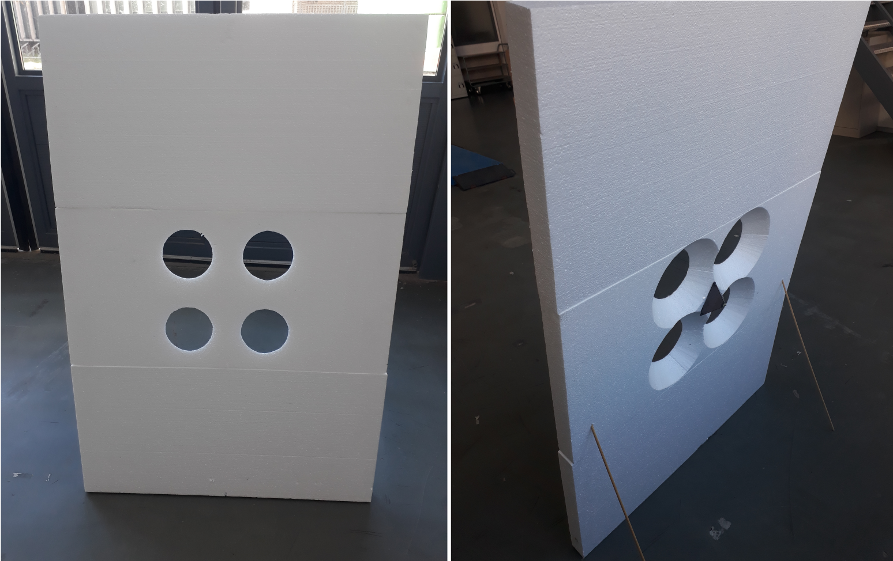
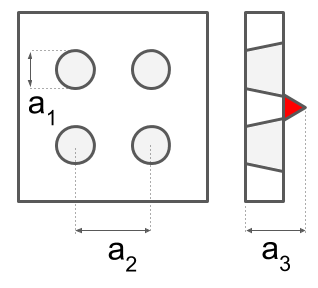

# CALIBRATION BOARD DESIGN
This file provides more details on the calibration board design.

# Description of calibration board
Our calibration board consist of a Styrofoam plate with four cut out circles. These circles are detectable by lidar and camera (both monocular and stereo). Furthermore, we have add a single trihedral corner reflector behind the Styrofoam in the middle of the four circles. Multiple reflector could be placed behind the plate, however we have not pursued this direction to avoid multiple reflections for radar.

NOTE: In case of multiple reflectors, these should not be positioned exactly vertically with respect to each other, because most radars cannot detect the elevation angle of target's position ('height').

# Geometry of the calibration calibration board
Our is calibration board is visualized in the following figure 1.
The left hand side shows the front of the calibration board and the right hand side the back of the calibration board. The total size of the plate is 1.5 m x 1.0 m. Note that the circles have slopes (see right figure in figure 1). This was done to enforce that lidar detections and camera detections are detected at the front the plate.

Figure 2 provides information of the geometry. In this drawing a1 is the circle diameter, which equals 15 cm in our case. The distance between circle centers a2 equals 24 cm. And reflector is a3 = 10.5 cm from the front.

<figure class="image">

<figcaption>Fig 2. Front (left) and back (right) of our calibration board. </figcaption>
</figure>

<figure class="image">

<figcaption>Fig 2. Geometry of lidar/camera target (circles) and radar target (trihedral corner reflector). </figcaption>
</figure>

# Materials
Our calibration board consists of:
- 1 trihedral corner reflector
- 3x Styrofoam plates of 1.0 m x 0.5 m
- 2x wooden sticks to keep it upright

# Recommendations
In this section, we have listed recommendations related to the calibration board:
- The calibration board is light (a few kilograms) and big, so special care should be taken if the calibration board is used outdoors. Wind could overturn the calibration board. We recommend to calibrate your sensors indoors.
- We recommend to make the circles as large as possible, because in that case you will have more lidar detections on the edge of the circles.
